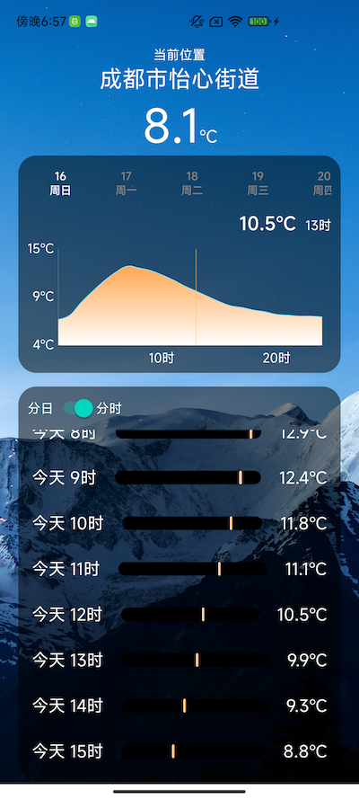
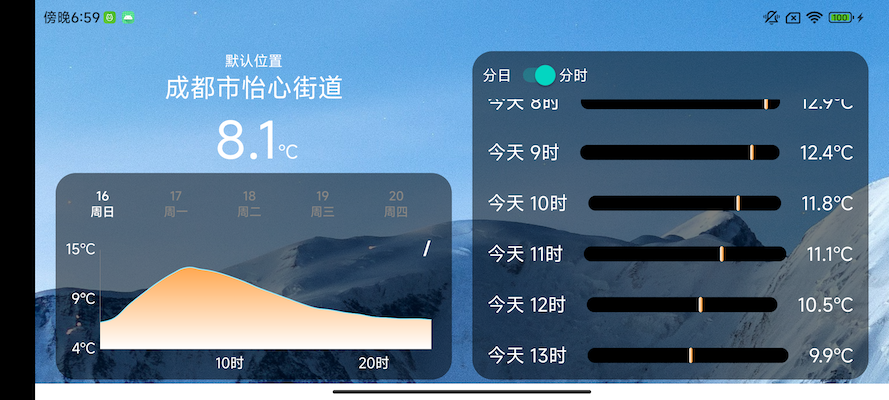

根据当前位置获取未来几天的天气，并通过图表展示
如果开启定位并且允许，会根据定位结构，请求当前地址的天气，并逆编码解析地址显示，否则默认显示成都的

1.上方表格显示一天的天气，可切换查看未来几天的，支持横向拉伸，点击查看具体时段的温度。所有表格的 Y 轴最小值和最大值采用
所有值进行计算，切换时报错视觉上的一致。
2.下方列表按天显示最高温和最低温，最小值和最大值与折线图的一致。可以切换成分时段显示，刻度线位置为大概温度水平。

支持横向布局

支持后台刷新数据，并且发送通知当前的温度

安卓系统限制刷新为 15分钟一次，为了便于查看，在前台请求时，也会发一条。